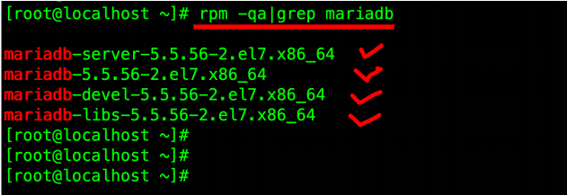
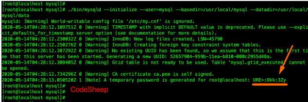
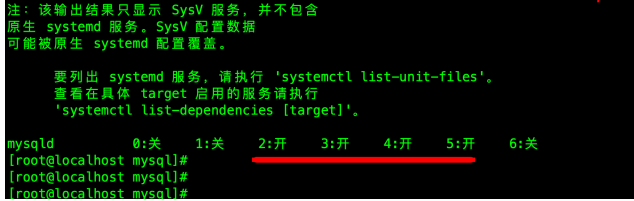
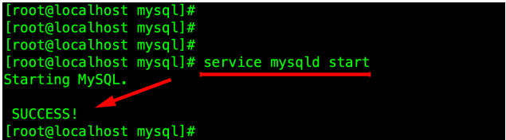
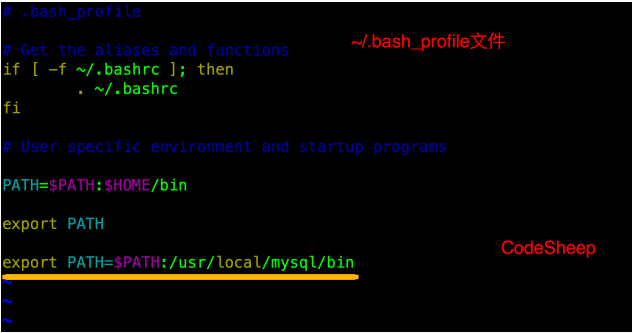
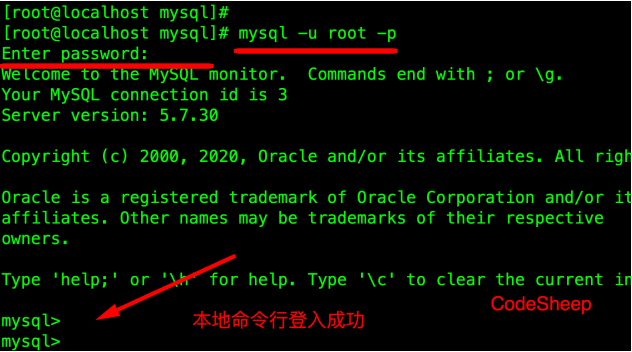

# MYSQL数据库部署和安装

## 首先准备安装包

- 这里下载的是mysql-5.7.37-linux-glibc2.12-x86_64.tar.gz安装包，并将其放在root目录下

## 卸载系统自带的Mariadb(如果有)

- 如果系统之前自带Mariadb，可以先卸载之
- 首先查询已安装的Mariadb安装包

```
rpm -qa|grep mariadb
```



- 将其均卸载之

```
yum -y remove [文件名]
```

## 解压MYSQL安装包

- 将上面准备好的MySQL安装包解压到/usr/local/目录中，并重新命名mysql

```
tar -zxvf /root/mysql-5.7.37-linux-glibc2.12-x86_64.tar.gz -C /usr/local/
mv mysql-5.7.37-linux-glibc2.12-x86_64 mysql
```

## 创建MySQL用户和用户组

```
gruopadd mysql
useradd -g mysql mysql
```
- 同时新建/usr/local/mysql/data目录，后续备用

## 修改MySQL目录的归属用户

```
(root@localhost mysql)# chown -R mysql:mysql ./
```

## 准备MySQL的配置文件

- 在/etc目录下新建my.cnf文件
- 写入如下简化配置：

```
[mysql]
#设置mysql客户端默认字符集
default-character-set=utf8
socket=/var/lib/mysql/mysql.sock

[mysqld]
skip-name-resolve
#设置3306端口
port=3306
socket=/var/lib/mysql/mysql.sock
#设置mysql安装目录
basedir=/usr/local/mysql
#设置mysql数据库的数据的存放目录
datadir=/usr/local/mysql/data
#允许最大连接数
max_connections=200
#服务端使用的字符集默认为8比特编码的latinl字符集
character-set-server=utf8
#创建新表时将使用的默认存储引擎
default-storage-engine=INNODB
lower_case_table_names=1
max_allowed_packet=16M
```

- 同时使用如下命令创建/var/lib/mysql目录，并修改权限：

```
mkdir /var/lib/mysql
chmod 777 /var/lib/mysql
```

## 正式开始安装MySQL

- 执行如下命令正式安装：

```
cd /usr/local/mysql
./bin/mysqld --initialize --user=mysql --basedir=/usr/local/mysql --datadir=/usr/local/mysql/data
```



> notice:记住上面打印出来的root的密码，后面首次登陆需要用到

## 复制启动脚本到资源目录

- 执行如下命令复制：

```
[root@localhost mysql]# cp ./supporrt-files/mysql.server /etc/init.d/mysqld
```

- 并修改/etc/init.d/mysqld,修改其basedir和datadir为实际对应目录：

```
basedir=/usr/local/mysql
datadir=/usr/local/mysql/data
```

## 设置MySQL系统服务并开启自启动

- 首先增加mysqld服务控制脚本执行权限：

```
chmod +x /etc/init.d/mysqld
```

- 同时将mysqld服务加入到系统服务

```
chkconfig --add mysqld
```

- 最后检查mysqld服务是否已经生效即可

```
chkconfig --list mysqld
```



> 这就表明mysqld服务已经生效了，在2、3、4、5运行级别随系统启动而自启动，以后就可以直接使用service命令控制mysql的启停。

## 启动MySQL

- 直接执行：

```
service mysqld start
```



## 将MySQL的bin目录加入path环境变量

- 这样方便以后在任何目录下都可以使用mysql提供的命令

- 编辑~/.bash_profile文件，在文件末尾处追加如下信息：

```
export PATH=$PATH:/usr/local/mysql/bin
```



- 最后执行如下命令使环境变量生效

```
source -/.bash_profile
```

## 首次登陆MySQL

- 以root账户登陆mysql，使用上文安装完成提示的密码进行登陆

```
mysql -u root -p
```



## 修改root账户密码

- 在mysql的命令行执行如下命令

```
mysql> alter user user() identified by "111111";
mysql> flush privileges;
```

## 设置远程主机登陆

```
mysql> use mysql;
mysql> update user set user.Host='%' where user.User='root';
mysql> flush privileges;
```

> 这样就可以利用navicat等工具进行远程访问