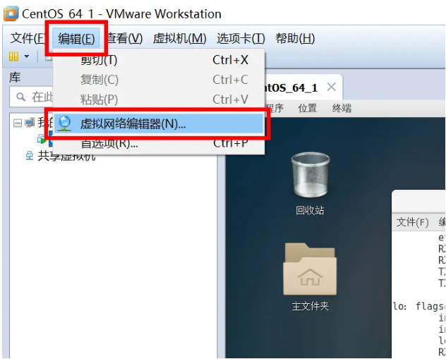
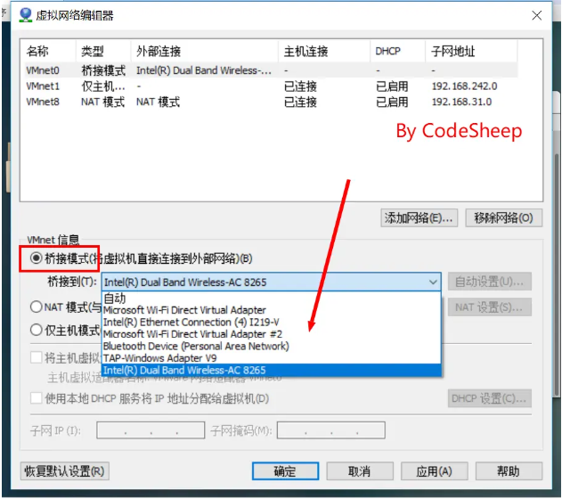
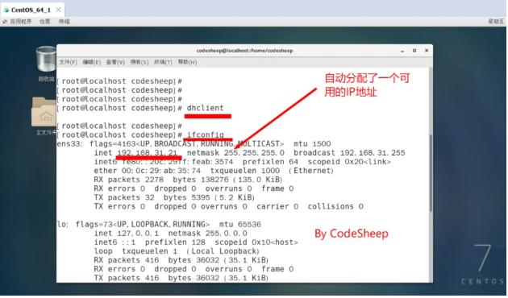
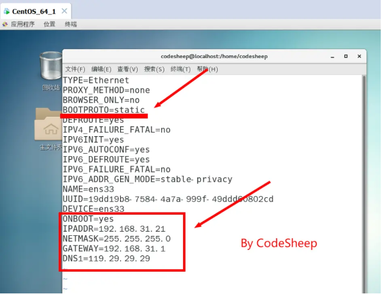

# Linux操作系统安装

> [参考文档](https://www.bilibili.com/read/cv5884033?spm_id_from=333.999.0.0)

## 软件版本

- 物理宿主机系统：Windows 10
- 虚拟机软件：VMware Workstation Pro
- Linux操作系统ISO镜像：CentOS 7.9 64位

## 安装步骤（暂时无图版，等我下次装吧）

1. 创建新的虚拟机
2. 选择虚拟机硬件兼容性
3. 加载Linux系统ISO镜像
4. 虚拟机命名并存储
5. 自定义虚拟机配置
...

## 网络配置

1. 设置虚拟机与宿主机的网络连接

- 选择桥接模式，并选择桥接到物理宿主机的上网网卡：

2. 为虚拟机配置固定静态IP
- 首先使用dhclient工具为本机分配一个网络内可用的ip地址

- 接下来编辑虚拟机系统网卡配置，将上面分配所得的IP地址配置进去：

```
vim /etc/sysconfig/network-scripts/ifcfg-ens33
```

- 修改配置如下：

```
TYPE="Ethernet"
PROXY_METHOD="none"
BROWSER_ONLY="no"
BOOTPROTO="static"
DEFROUTE="yes"
IPV4_FAILURE_FATAL="no"
IPV6INIT="yes"
IPV6_AUTOCONF="yes"
IPV6_DEFROUTE="yes"
IPV6_FAILURE_FATAL="no"
IPV6_ADDR_GEN_MODE="stable-privacy"
NAME="ens33"
UUID="37164729-0f4c-4eb3-bf89-5a807ca01b4e"
DEVICE="ens33"
ONBOOT="yes"
IPADDR=192.168.3.*    //分配的IP地址
NETMASK=255.255.255.0
GATEWAY=192.168.3.1
DNS1=119.29.29.29
```

- 尤其注意下图红色标记部分的配置：


- 编辑完成，重启网络设置即可：
```
systemctl restart network.service
```

- 检查虚拟机系统网络和外界的连通性

- 至此，大功告成！
