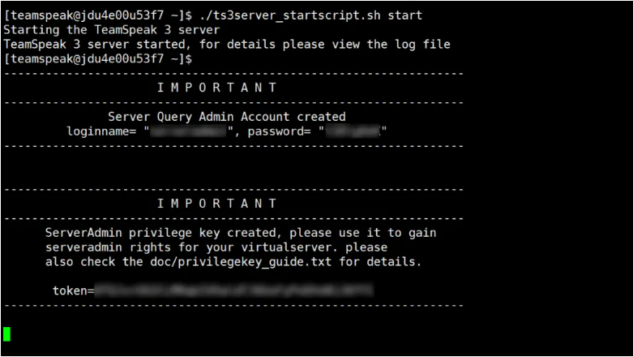
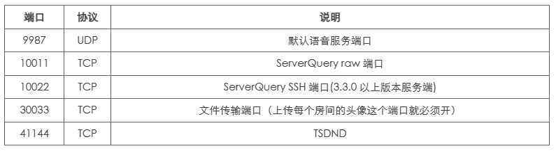

# Teamspeak3服务端的安装及启动

## 1.系统设置

- 在进行服务器安装之前，执行一下系统更新操作，这里是Centos7×64系统

```
yum -y update
```
- 添加运行TeamSpeak程序的用户，出于安全性的考虑，TeamSpeak服务器并不建议使用 root 用户来执行，所以我们可以创建一个用户 teamspeak 来单独执行TeamSpeak服务器程序。使用如下命令创建用户 teamspeak 并为其设置密码

```
useradd teamspeak
passwd teamspeak //密码随意填写
```
- 从TeamSpeak官方网站下载最新版的服务器程序，将其复制到root目录，进行解压，比如我的文件名是teamspeak3-server_linux_amd64-3.10.2.tar.bz2

```
tar xvf teamspeak3-server_linux_amd64-3.10.2.tar.bz2
```
- 将刚才解压好的文件夹改名为teamspeak3并拷贝到/home/teamspeak，方便授权及文件管理

```
mv teamspeak3-server_linux_amd64 teamspeak3
cp -R teamspeak3 /home/teamspeak/
chown -R teamspeak:teamspeak /home/teamspeak/teamspeak3/
```

## 2.同意许可证

- 切换teamspeak用户，进行启动前的准备操作

```
su teamspeak
cd
cd teamspeak3
touch .ts3server_license_accepted
```

## 3.启动服务器

```
./ts3server_startscript.sh start
```
- notice：可能会出现没有文件权限的问题，可以输入以下代码赋予权限`chmod u+x *.sh`

- 第一次启动会显示密钥及 ServerQuery 管理员账户和密码，请注意保存


## 4.teamspeak的一些端口开放


