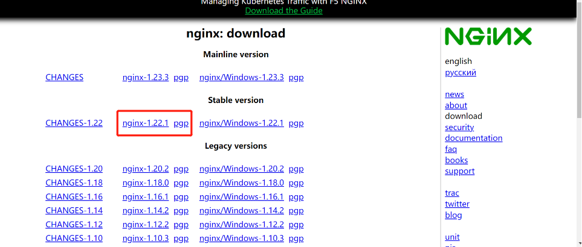
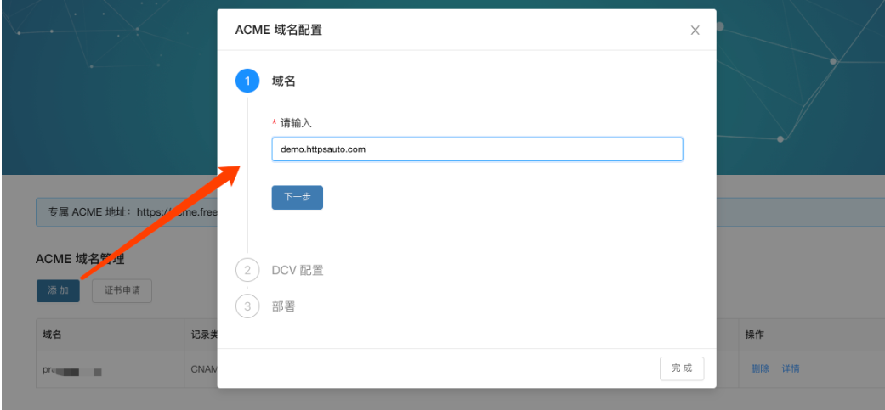
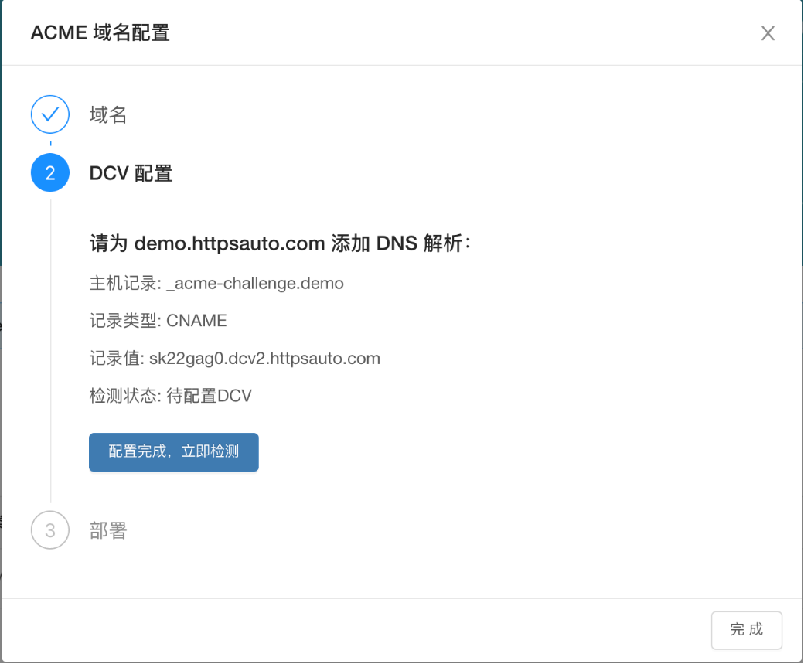
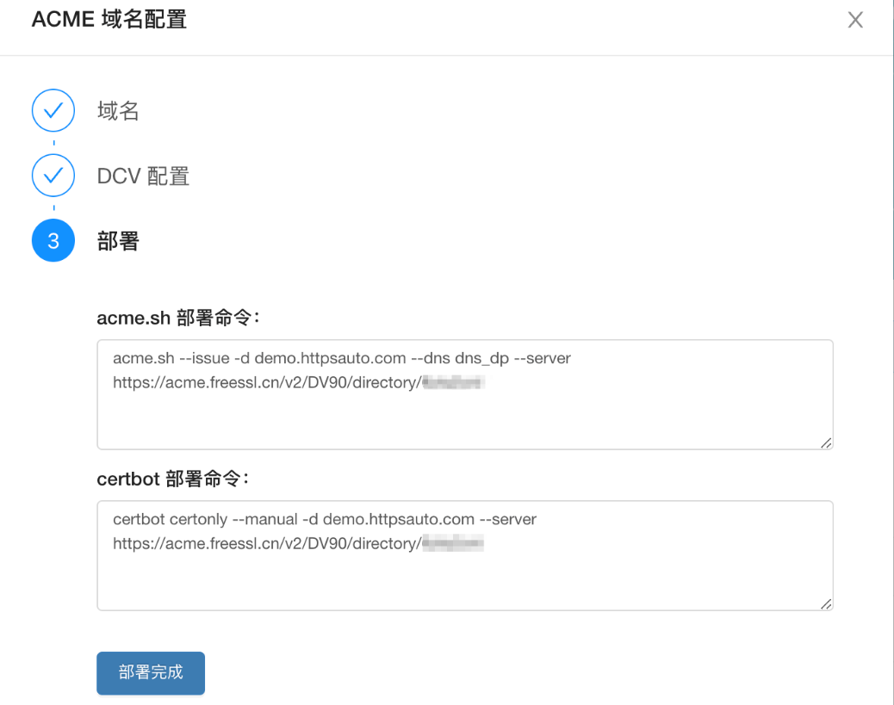

# Nginx的安装、配置和使用

## nginx的安装

>  目前支持两种安装方式，一种是apt-get的方式，另一种是根据包安装的方式

### 1、apt-get安装nginx

输入安装命令
```
apt-get install nginx
```

查看nginx是否安装成功
```
nginx -v
```

启动nginx
```
service nginx start
```

nginx文件安装完成之后的文件位置：

- /usr/sbin/nginx：主程序
- /etc/nginx：存放配置文件
- /usr/share/nginx：存放静态文件
- /var/log/nginx：存放日志

### 2、包安装

1）安装依赖

```
sudo apt update

sudo apt-get install gcc
sudo apt-get install ruby
sudo apt-get install build-essential
sudo apt-get install libtool
sudo apt-get install libpcre3 libpcre3-dev
sudo apt-get install zlib1g-dev
sudo apt-get install openssl
sudo apt-get install libssl-dev
```
> 或者通过一行命令
```
sudo apt-get install gcc ruby build-essential libtool libpcre3 libpcre3-dev zlib1g-dev libssl-dev
```

2）下载nginx

[下载地址](http://nginx.org/en/download.html)

选择如下稳定版本


3）安装步骤

```
#进入local文件夹
cd /usr/local

#创建文件夹,案列地址为 /usr/local/nginx
sudo mkdir nginx

#进入/nginx
cd /usr/local/nginx/

#下载安装包
wget http://nginx.org/download/nginx-1.22.1.tar.gz

#解压nginx-1.22.1.tar.gz
tar -xvf nginx-1.22.1.tar.gz

#解压后生成nginx-1.22.1文件夹，进入该文件夹
cd nginx-1.22.1

#设置参数，支持ssl
./configure --prefix=/usr/local/nginx --with-http_stub_status_module --with-http_ssl_module

#编译
sudo make

#安装
sudo make install

#检测是否安装成功
cd /usr/local/nginx/sbin
./nginx -t 
```

4）配置


## SSL证书安装

[参考文档](https://normalcoder.com/tech-essay/ssl/automate-ssl-certificate-by-freessl-acme-v2/)

### 1、安装acme.sh
- 建议切换到root模式，可以减少证书安装时的问题
```
curl https://get.acme.sh | sh -s email=my@example.com
```

> 如果上面官方下载地址失败 或者 太慢，可以选用国内的备用地址
```
curl https://gitcode.net/cert/cn-acme.sh/-/raw/master/install.sh?inline=false | sh -s email=my@example.com
```

### 2、对域名进行授权

1）输入域名


2）获得域名验证（DCV）授权信息


3）到您的域名解析服务商添加解析记录，下面以DNSPod为例：


### 3、证书申请 & 部署

1）点击【配置完成，立即检测】后获得证书申请命令


2）部署到 WebServer

Nginx example:
```
acme.sh --install-cert -d example.com \
--key-file       /usr/local/nginx/conf/cert/key.pem  \
--fullchain-file /usr/local/nginx/conf/cert/cert.pem \
--reloadcmd     "service nginx force-reload"
```