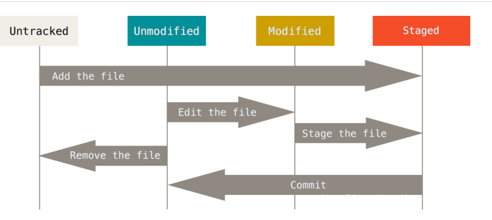

# Git命令大全

 [官方中文手册](https://git-scm.com/book/zh/v2)

 [参考文档](https://blog.csdn.net/qq_42363495/article/details/104878170)

 ## Git配置
 - `git config -l` 查看当前git环境详细配置

 ### 查看系统config
 - `git config --system --list`
 - 配置文件在git安装目录/etc/gitconfig

 ### 查看当前用户配置
 - `git config --global --list`
 - 配置文件在~/.gitconfig

 ### 查看当前仓库配置信息
 - `git config --local --list`
 - 配置文件在当前项目的/.git/config

 ### 修改git配置
 - `git config [--local][--global][--system] section.key value`
 - `git config --local user.name huhuhu` 设置当前项目的用户名
 - `git config --global core.quotepath false` 配置当前用户的编码项，可以解决中文编码问题
 - `git config --local core.ignorecase false` 配置当前项目不忽略文件大小写，git默认忽略文件名的大小写，这点值得注意

 ## Git基础知识

 ### git文件的四种状态
 

 - Untracked: 未跟踪, 此文件在文件夹中, 但并没有加入到git库, 不参与版本控制. 通过git add 状态变为Staged.
 - Unmodify: 文件已经入库, 未修改, 即版本库中的文件快照内容与文件夹中完全一致. 这种类型的文件有两种去处, 如果它被修改, 而变为Modified. 如果使用git rm移出版本库, 则成为Untracked文件
 - Modified: 文件已修改, 仅仅是修改, 并没有进行其他的操作. 这个文件也有两个去处, 通过git add可进入暂存staged状态, 使用git checkout 则丢弃修改过, 返回到unmodify状态, 这个git checkout即从库中取出文件, 覆盖当前修改
 - Staged: 暂存状态. 执行git commit则将修改同步到库中, 这时库中的文件和本地文件又变为一致, 文件为Unmodify状态. 执行git reset HEAD filename取消暂存, 文件状态为Modified

 ## Git常用命令

### init && clone
- `git init` 在当前目录新建一个仓库
- `git init [project-name]` 在一个目录下新建本地仓库
- `git clone [url]` 克隆一个远程仓库

### diff
- `git diff HEAD -- .` 查看最新本地版本库和工作区所有文件的区别
- `git diff HEAD -- [file-name]` 查看最新本地版本库和工作区文件的却别
- `git diff HEAD^ -- [file-name]` 查看本地上一个版本和工作区文件的却别
- `git diff [local branch] origin/[remote branch]` 比较本地分支和远程分支的区别

### status
- `git status [file-name]` 查看指定文件状态
- `git status` 查看所有文件状态

### add
- `git add [file-name1] [file-name2] ...` 从工作区添加指定文件到暂存区
- `git add . `将工作区的被修改的文件和新增的文件提交到暂存区，不包括被删除的文件
- `git add -u .`u指update，将工作区的被修改的文件和被删除的文件提交到暂存区，不包括新增的文件
- `git add -A .` A指all，将工作区被修改、被删除、新增的文件都提交到暂存区

### commit
- `git commit -m [massage]` 将暂存区所有文件添加到本地仓库
- `git commit [file-name-1] [file-name-2] -m [massage]` 将暂存区指定文件添加到本地仓库
- `git commit -am [massage]` 将工作区的内容直接加入本地仓库
- `git commit --amend` 快速将当前文件修改合并到最新的commit，不会产生新的commit。在提交commit后发现还有部分文件修改忘记提交了可以是用该命令
- 加-m是指直接在后面写上版本的注释，不加-m的话会用一个vim打开文件让你写入massage，有未追踪的文件将会失败，需要add加入暂存区。

### push
- `git push` 将文件添加到远程仓库
- `git push -f` 强制提交，当我们本地reset到旧的版本时，然后普通push会被拦截，因为此是本地HEAD指向比远程库还要旧
- `git push origin [branch-name]` 推送当前本地分支到指定远程分支

### clean
- `git clean -df` 加-d是指包含目录，加-f是指强制，删除所有未跟踪的文件

### log
- `git log` 显示所有commit日志
- `git log --pretty=oneline` 将日志缩写为单行显示
- `git log --graph --pretty=oneline --abbrev-commit` 查看分支合并情况
- `git log --oneline --decorate --graph --all` 查看分叉历史，包括：提交历史、各个分支的指向以及项目的分支分叉情况。
- `git log -3` 查看最新3条commit日志数据

### reflog
- `git reflog` 显示操作本地版本库的命令，包括commit和reset等，在回退版本以后又后悔找不到commit id了可以使用此命令查看历史


## 实际使用

- 上传GitHub流程
```
//提交到暂存区
git add . 或者git add -A .
//添加到本地仓库
git commit -m ""
//添加到远程仓库
git push
```